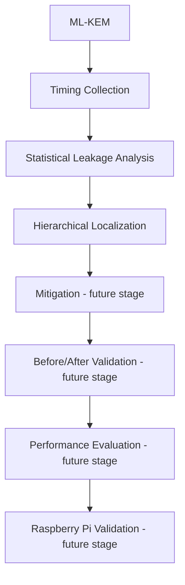

# Timing Side-Channel Leakage Detection and Mitigation Framework for ML-KEM using Raspberry Pi

## 1. Project Overview

PQCShield is a software framework for measuring and analyzing execution-time variation in ML-KEM operations. ML-KEM is the standardized post-quantum key-encapsulation mechanism derived from CRYSTALS-Kyber. The project uses the real Open Quantum Safe implementation through `liboqs-python`, rather than a simulated cryptographic algorithm.

The implemented software workflow can:

- Generate, encapsulate, and decapsulate ML-KEM-768 keys and ciphertexts.
- Collect repeated execution-time measurements for key generation, encapsulation, and decapsulation.
- Compare timing populations using descriptive statistics and Welch's independent two-sample t-test.
- Rank explicit Python-level ML-KEM wrapper regions by normalized timing variability.
- Generate CSV reports, plots, and a Flask dashboard for the existing analysis workflow.
- Run in a reproducible Docker environment and in GitHub Actions CI.

The project is designed for eventual validation on Raspberry Pi. Raspberry Pi deployment and target-hardware experiments are not complete in the current repository. Current results are software and container-based validation results, not Raspberry Pi measurements.

## 2. Problem Statement

A cryptographic implementation may take different amounts of time depending on secret data, input data, or internal execution paths. If an attacker can measure those differences repeatedly, execution time can become a side channel that provides information about secret-dependent computation.

ML-KEM is intended for security-critical post-quantum cryptography. Timing behavior therefore needs to be measured and validated carefully, especially when an implementation or deployment uses constrained hardware. Detecting a statistical difference in timing distributions is an important diagnostic step, but it is not by itself proof of a vulnerability or proof of secure constant-time behavior.

## 3. Motivation

### Post-Quantum Cryptography

Large-scale quantum computers could threaten widely used public-key systems based on factoring or discrete logarithms. Post-quantum cryptography develops algorithms intended to remain secure against known classical and quantum attack models.

### ML-KEM and CRYSTALS-Kyber

ML-KEM is a standardized post-quantum key-encapsulation mechanism based on the CRYSTALS-Kyber design. It provides key generation, encapsulation, and decapsulation operations for establishing a shared secret.

### Timing Side Channels

Even when the mathematical algorithm is correct, implementation details such as secret-dependent branches, variable work, memory behavior, or arithmetic paths can affect execution time. Repeated timing measurements can reveal whether observable timing distributions differ under selected conditions.

### Practical Timing Analysis

A useful analysis workflow needs repeatable collection, explicit data formats, statistical tests, visualizations, and a way to identify which measured operation or instrumentable region deserves further investigation.

### Repeatable Validation

PQCShield provides a software baseline that can be repeated locally, in Docker, and in CI. More controlled experiments can later be added for target hardware and controlled secret or input classes.

## 4. Objectives

| Objective | Status |
|---|---|
| Implement ML-KEM through a real cryptographic library. | Implemented with `liboqs-python` and ML-KEM-768. |
| Collect execution-time measurements. | Implemented with nanosecond timing records. |
| Analyze timing measurements statistically. | Implemented with descriptive statistics and Welch's t-test. |
| Localize timing variability hierarchically. | Implemented at explicit Python wrapper-region boundaries. |
| Apply and validate mitigation techniques in the research phase. | Generic variable-work versus fixed-work demonstration exists; ML-KEM mitigation is future work. |
| Compare leakage before and after a mitigation. | Generic software demonstration exists; a controlled ML-KEM before/after mitigation experiment is future work. |
| Evaluate performance overhead. | The software demonstration calculates overhead; ML-KEM mitigation overhead evaluation is future work. |
| Validate the framework on Raspberry Pi. | Future work. |

## 5. Current Architecture

```text
Real ML-KEM implementation
            |
            v
Timing Collection
            |
            v
Welch Statistical Analysis
            |
            v
Hierarchical Localization
            |
            v
Reports / Visualization
```

### Real ML-KEM Implementation

`collector/benchmark.py` contains the hardware-independent `MLKEMWrapper`. It calls `oqs.KeyEncapsulation` for the selected algorithm, defaulting to ML-KEM-768.

### Timing Collection

`collector/timer.py` uses `time.perf_counter_ns()` and stores operation name, start time, end time, duration, and a condition label. `collector/benchmark.py` repeatedly measures key generation, encapsulation, and decapsulation. `collector/traces.py` writes and loads timing CSV files.

### Welch Statistical Analysis

`analyzer/welch.py` uses `scipy.stats.ttest_ind` with `equal_var=False`. `analyzer/statistics.py` calculates count, mean, median, standard deviation, and variance. `analyzer/leakage.py` combines these functions to create a per-operation report and visualizations.

### Hierarchical Localization

`analyzer/localization.py` measures explicit wrapper-level regions around real ML-KEM calls and ranks them using a normalized timing-variability score. This is a software baseline and does not inspect hidden native liboqs functions.

### Reports and Visualization

The analysis modules generate CSV reports and PNG figures under `reports/`. The Flask dashboard in `app.py` uses the existing analysis and mitigation workflow to display reports, plots, and localization information.

## 6. Technology Stack

The repository uses:

- Python 3.11 as the documented project runtime and Docker base runtime.
- Open Quantum Safe `liboqs` native library.
- `liboqs-python` for the Python ML-KEM binding.
- NumPy for numerical operations.
- SciPy for Welch's t-test.
- Pandas for trace and report data.
- Matplotlib for timing and localization figures.
- Plotly for dashboard chart serialization.
- Flask for the lightweight dashboard.
- Linux for the validated development and container environment.
- Docker for reproducible container execution.
- Git for version control.
- GitHub Actions for CI validation.

## 7. Implemented Modules

### `collector/`

- `timer.py`: high-resolution operation timing and `TimingRecord`.
- `benchmark.py`: real `liboqs-python` ML-KEM wrapper and repeated ML-KEM benchmark runner.
- `traces.py`: CSV persistence and validation for timing records.

### `analyzer/`

- `welch.py`: Welch's independent two-sample t-test.
- `statistics.py`: descriptive timing statistics.
- `leakage.py`: per-operation file analysis, leakage report generation, and histograms, box plots, and mean charts.
- `localization.py`: hierarchical wrapper-region timing, ranking, report generation, and ranking chart.

### `mitigation/`

- `constant_time.py`: a generic replaceable routine interface with variable-work and fixed-iteration teaching implementations.
- `validator.py`: repeated timing of those generic routines over alternating low and high example values.
- `comparison.py`: comparison of generic before/after traces and overhead calculation.

This mitigation package does not patch or replace an ML-KEM/liboqs routine. A verified constant-time ML-KEM mitigation is future research work.

### `dashboard/` and `app.py`

The Flask application writes and displays the existing software mitigation report. Dashboard support includes report serialization, Plotly chart data, timing plots, and a localization table.

### `reports/`

The report directory contains generated analysis artifacts when experiments are run, including `leakage_report.csv`, `localization_report.csv`, timing figures, and localization ranking figures. Generated reports are outputs, not cryptographic proof.

## 8. ML-KEM Implementation

The project integrates real ML-KEM through `oqs.KeyEncapsulation`. The default algorithm is `ML-KEM-768`.

The implemented wrapper supports:

1. Key generation, returning public and secret key bytes.
2. Encapsulation using the public key, returning ciphertext and sender shared-secret bytes.
3. Decapsulation using the ciphertext, returning the recovered shared-secret bytes.

The self-test is run with:

```bash
python3 -m collector.benchmark
```

It generates a real key pair, encapsulates a shared secret, decapsulates the ciphertext, and verifies that the two shared secrets match. The observed successful result was:

```text
ML-KEM self-test succeeded using ML-KEM-768
```

## 9. Timing Measurement

The collector uses `time.perf_counter_ns()` for high-resolution elapsed-time measurement. Each timing record contains:

- Operation name.
- Start timestamp.
- End timestamp.
- Duration in nanoseconds.
- Experimental label, such as `before` or `after`.

The ML-KEM benchmark measures key generation, encapsulation, and decapsulation repeatedly. The completed project-scale experiment produced 60,000 timing records in total: 30,000 records in `data/before.csv` and 30,000 records in `data/after.csv`, corresponding to 10,000 samples per operation and condition.

These measurements demonstrate the collection workflow. They do not prove the presence or absence of a timing side channel because the experiment was not a controlled secret/input-class TVLA experiment.

## 10. Welch Statistical Analysis

Welch's t-test is used because it compares two independent sample populations without assuming that their variances are equal. This is appropriate for timing data, where variance can differ between conditions.

The analysis reports:

- A signed t-score, indicating the direction of the difference between the compared means.
- A p-value, indicating how compatible the observed difference is with the null hypothesis under the test model.
- A significance rule of `p < 0.05` for the report status.

The current `reports/leakage_report.csv` contains:

| Operation | Samples Before | Samples After | t-score | p-value | Status |
|---|---:|---:|---:|---:|---|
| Decapsulation | 10,000 | 10,000 | -1.4538 | 0.1460 | No significant leakage |
| Encapsulation | 10,000 | 10,000 | -0.9125 | 0.3615 | No significant leakage |
| Key generation | 10,000 | 10,000 | 1.3356 | 0.1817 | No significant leakage |

The current experiment did not show statistically significant timing differences under the tested conditions. This result does not establish the absence of timing leakage. A controlled secret/input-class experiment is required for stronger leakage validation.

## 11. Hierarchical Timing Localization

The localization design has two levels:

### Level 1: ML-KEM Operation

The top-level operation is one of:

- `key_generation`
- `encapsulation`
- `decapsulation`

### Level 2: Instrumentable Software Region

The current software baseline defines these explicit regions:

- `wrapper_keygen`
- `wrapper_encapsulation`
- `wrapper_decapsulation`

`analyzer/localization.py` measures the complete Python wrapper call boundary, calculates mean, standard deviation, variance, coefficient of variation, and a normalized timing-variability score, then ranks the regions.

The current localization operates at the Python wrapper level. It does not identify hidden native liboqs C functions. The `RegionInstrumentor` interface is intended to allow a future native instrumentor to provide finer-grained regions without redesigning the report layer.

The latest generated report used 20 combined samples per region, reflecting the latest small local validation run. The report ranked all three wrapper regions; the ranking is not a cryptographic leakage proof.

## 12. Docker Containerization

The repository includes a `Dockerfile` based on Python 3.11 slim. It installs the native build tools and libraries needed by `liboqs-python`, installs dependencies from `requirements.txt`, and includes Git for liboqs-python's automatic native liboqs installation.

The image runs the application as the non-root `pqcshield` user. `.dockerignore` excludes Git metadata, virtual environments, caches, generated CSVs, and generated reports from the image context. Host `data/` and `reports/` directories can be mounted to preserve outputs.

The image was successfully built and validated with:

```bash
docker build -t pqcshield:latest .
docker run --rm pqcshield:latest python3 -m collector.benchmark
docker run --rm pqcshield:latest python3 -m analyzer.localization
```

The Docker ML-KEM self-test succeeded with ML-KEM-768, and the Docker localization run succeeded for the three wrapper-level regions. Docker provides a reproducible software environment, but it does not make CPU timing independent of host scheduling, virtualization, or system load.

## 13. CI/CD Pipeline

The GitHub Actions workflow is defined in `.github/workflows/ci.yml`.

It runs on:

- Pushes to `main`.
- Pushes to `review-devops`.
- Pull requests targeting `main`.

The pipeline is:

```text
Python validation
        |
        v
ML-KEM self-test
        |
        v
Small localization validation
        |
        v
Docker image build
```

The workflow compiles the Python project, installs native and Python dependencies, runs `python3 -m collector.benchmark`, runs localization with a small sample count, verifies that `reports/localization_report.csv` is non-empty, and builds the Docker image.

The 10,000-sample experiment is intentionally not run automatically in CI. Hosted runners have variable scheduling, CPU frequency, virtualization, and background load, so large timing runs would be slow and would not provide controlled side-channel evidence.

## 14. Current Results

The verified results currently available in the repository and completed validation runs are:

- The real ML-KEM-768 self-test succeeded.
- The project-scale timing experiment collected 60,000 ML-KEM timing records.
- Welch analysis generated `reports/leakage_report.csv` with 10,000 before and 10,000 after samples for each of the three operations.
- The current Welch report statuses are not statistically significant at `p < 0.05` for key generation, encapsulation, or decapsulation under the tested conditions.
- Three wrapper-level regions were localized: `wrapper_keygen`, `wrapper_encapsulation`, and `wrapper_decapsulation`.
- The Docker image built successfully.
- The Docker ML-KEM self-test succeeded.
- Docker localization succeeded and generated the localization report.
- Local CI-equivalent syntax, self-test, localization, YAML, Docker build, and `git diff --check` validations succeeded.

These results describe successful execution of the framework. They do not establish the absence of side-channel leakage or security of ML-KEM under all inputs, secrets, machines, or deployment conditions.

## 15. Limitations

- The current timing experiment is not a controlled secret/input-class TVLA experiment.
- The current before/after ML-KEM datasets do not constitute a true mitigation experiment.
- Current localization is limited to Python-level wrapper regions.
- Hidden native liboqs implementation regions are not currently localized.
- Raspberry Pi deployment and Raspberry Pi measurements are not completed.
- A constant-time mitigation for the actual ML-KEM/liboqs implementation is not implemented.
- Final performance-overhead evaluation for an ML-KEM mitigation is not completed.
- Timing measurements are affected by operating-system scheduling, CPU frequency behavior, virtualization, background load, and other system noise.
- Python timing cannot establish machine-level constant-time behavior.

## 16. Future Work

1. Design a controlled secret/input-class timing experiment.
2. Apply Welch or TVLA-style leakage detection to controlled classes.
3. Add a controlled variable-time validation baseline for the research experiment.
4. Implement and verify a constant-time ML-KEM mitigation in appropriate native code.
5. Automate before/after leakage validation for that mitigation.
6. Measure performance overhead under controlled conditions.
7. Add native ML-KEM/liboqs instrumentation for finer-grained localization.
8. Deploy and validate the framework on Raspberry Pi hardware.
9. Run the final integrated experiment combining collection, leakage analysis, localization, mitigation, and performance evaluation.

## 17. Project Workflow



The implemented path currently reaches real ML-KEM execution, timing collection, Welch analysis, wrapper-level localization, reports, visualizations, Docker validation, and CI validation. Mitigation of the real ML-KEM implementation, controlled before/after validation, performance evaluation for that mitigation, and Raspberry Pi validation remain future stages.

## 18. Reproducibility

Run these commands from the project root.

### Install dependencies

```bash
python3 -m pip install -r requirements.txt
```

The project also documents the equivalent virtual-environment setup in `README.md` and `docs/how_to_run.md`.

### ML-KEM self-test

```bash
python3 -m collector.benchmark
```

### Timing experiment

```bash
python3 run_experiment.py --mode kem --algorithm ML-KEM-768 --samples 10000
```

### Leakage analysis

```bash
python3 -m analyzer.leakage
```

### Hierarchical localization

```bash
python3 -m analyzer.localization
```

The existing localization CLI uses its default sample count. For a small local validation run, call the existing API:

```bash
python3 - <<'PY'
from analyzer.localization import localize
localize(sample_count=10)
PY
```

### Docker build

```bash
docker build -t pqcshield:latest .
```

### Docker ML-KEM test

```bash
docker run --rm pqcshield:latest python3 -m collector.benchmark
```

### Docker localization

```bash
docker run --rm pqcshield:latest python3 -m analyzer.localization
```

### CI/CD

GitHub Actions runs automatically for pushes to `main` and `review-devops`, and for pull requests targeting `main`. It performs Python validation, the real ML-KEM self-test, small-sample localization validation, report verification, and a Docker image build.
